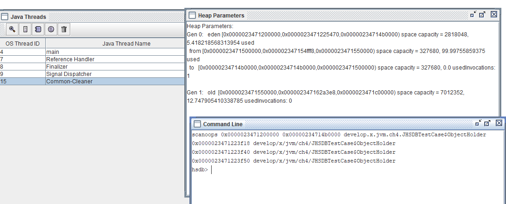
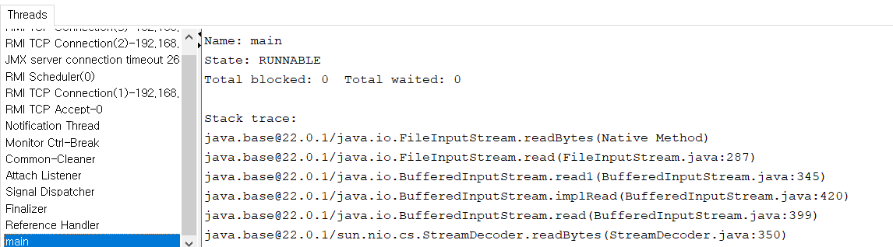
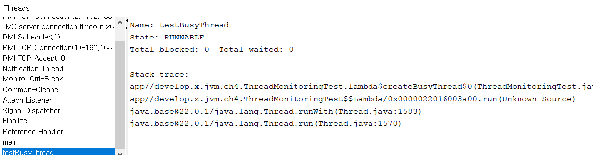
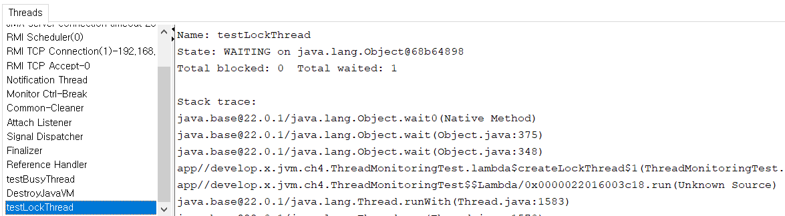
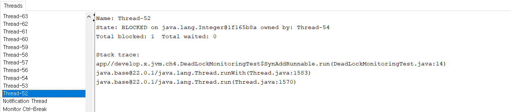

# 4장 가상 머신 성능 모니터링과 문제 해결 도구

## 4.2 기본적인 문제 해결 도구
- JDK 의 bin 디렉토리에 있는 도구 중 가상 머신 상태 모니터링과 문제 해결에 쓰이는 도구들이 존재한다. 
- 이 도구들은 라이선스와 성숙 수준에 따라 3가지 범주로 나눌 수 있다. 
  - 상용 인증 도구: JMC, JFR 이 여기에 속한다. 개인 개발 목적으로는 무료이나 상용환경에서 이용하려면 비용을 지불해야 한다. 
  - 공식 지원 도구: 장기간 지원 도는 도구들이다. 
  - 실험적 도구: 공식 지원되지 않으면 실험적으로 제공되는 도구이다. 

### 4.2.1 jps: 가상 머신 프로세스 상태 도구 
- jps 의 이름은 유닉스 ps 명령어에서 따왔고, 기능도 비슷하다. 
- 동작 중인 가상 머신 프로세스 목록을 보여주며 각 프로세스에서 가상 머신이 실행한 메인 클래스의 이름과 로컬 가상 머신 식별자를 알려준다. 

### 4.2.2 jstat: 가상 머신 통계 정보 모니터링 도구
- JVM 통계적 모니터링 도구인 jstat 은 가상 머신의 다양한 작동 상태 정보를 모니터링 하는데 사용한다. 
- 가상 머신 프로세스의 클래스 로딩, 메모리, GC, JIT 컴파일 같은 런타임 데이터를 보여준다. 

### 4.2.3 jinfo: 자바 설정 정보 도구
- jinfo 는 가상 머신의 다양한 매개 변수를 실시간으로 확인하고 변경하는 도구다. 

### 4.2.4 jmap: 자바 메모리 매핑 도구
- jmap 은 힙 스냅숏을 파일로 덤프해 주는 자바용 메모리 맵 명령어이다. 
- 힙 스냅숏 덤프 외에도 jmap 으로 F-큐(finalize() 메서드 호출을 기다리는 객체들을 담는 큐), 자바 힙과 메서드 영역 상세 정보도 알 수 있다. 

### 4.2.5 jhat: 가상 머신 힙 덤프 스냅숏 분석 도구 
- jhat 은 JDK 8까지 제공되던 JVM 힙 분석 도구로 jmap으로 덤프한 힙 스냅숏을 분석할 수 있다. 
- jhat 은 작은 HTTP-웹 서버를 내장하고 있어서 분석이 완료되면 웹 브라우저로 결과를 살펴 볼 수 있다. 
- 나중에 소개할 VisualVM 이나 이클립스 메모리 분석기, IBM 힙 분석기 등의 전문 분석 도구가 기능면에서 jhat 보다 뛰어나다. 

### 4.2.6 jstack: 자바 스택 추적 도구
- 스택 추적 도구인 jstack 은 현재 가상 머신의 스레드 스냅숏을 생성하는 데 쓰인다. 
- 일반적으로 스레드 덤프 또는 자바 코어 파일이라고 부른다.
- 스레드 스냅숏은 현재 가상 머신에서 실행 중인 각 스레드의 메서드 스택들의 집합이다. 
- 주로 스레드가 장시간 멈춰 있을 떄 원인을 찾기 위해 생성한다.
- 주된 원인은 스레드 사이의 교착 상태, 무한 루프 외부 자원 요청으로 인한 긴 기다림이다. 
- 스레드가 멈춰 있다면 jstack 으로 각 스레드의 호출 스택을 볼 수 있다. 
- java.lang.Thread 클래스에 추가된 getAllStackTraces() 메서드로 가상 머신이 실행하는 모든 스레드의 StackTraceElement 객체를 얻을 수 있다. 


### 4.2.7 기본 도구 요약 

#### 4.2.7.1 기본도구 
| 이름           | 용도| JDK 버전 |
|--------------| --|--------|
| appletviewer | web browser 없이 애플릿 실행 및 디버깅| 7-10   |
| extcheck     | jar 충돌 검사| 7-8    |
| jar          | jar 파일 생성 및 관리| 7~     |
| java         | 클래스 파일이나 jar 파일 실행| 7~     |
| javac        | 자바 언어용 컴파일러| 7~     |
| javadoc      | 자바 API 문서 생성기| 7~     |
| javah        | JNI 메서드 작성요 C언어 헤더 파일과 stub 파일 생성기| 7-9    |
| javap        | 자바 바이트 코드 분석| 7~     |
| jlink        | 모듈과 의존성들을 런타임 이미지 파일로 패키징| 7~     |
| jdb| JPDA 프로토콜 기반의 자바 코드 디버거| 7~|
|jdeps| 자바 클래스 의존성 분석기| 7~|
| jdeprscan| JAR 패키지에서 사용 중인 폐기 대상 클래스 검색| 7~|
| jwebserver| 프로토타이핑, 테스팅, 디버깅용 간단한 웹 서버 HTTP 1.1과 정적 파일만 지원| 18~|

#### 4.2.7.2 보안도구
| 이름| 용도| JDK 버전|
| --| --| --|
|keytool| 키 저장소와 인증서 관리| 7~|
|jarsigner| jar 서명 생성 및 검증| 7~|
|policytool| 정책 파일 관리용 GUI 도구, 사용자 정책 파일 관리에 사용한다.| 7-9|


#### 4.2.7.3 국제화 도구 
| 이름| 용도| JDK 버전|
| --| --| --|
| native2ascil| 네이티브 -> 아스키 변환기| 7-8|


#### 4.2.7.4 원격 메서드 호출 도구 (네트워크를 통한 서비스 상호 작용)
| 이름| 용도| JDK 버전|
| --| --| --|
| rmic| 자바 RMI 컴파일러| 7-14|
| rmiregistry| 원격 객체 레지스트리 서비스, 포트를 지정하여 현재 호스트에서 원격 객체 레지스트리를 생성하고 시작한다.| 7~|
| rmid| 활성화 시스템 데몬 실행, 가상 머신에서 객체들의 등록과 활성화를 허용한다.| 7~16|
| seialver| 명시한 클래스의 직렬화 버전 아이디를 생성해 반환한다.| 7~|


#### 4.2.7.5 JVM 성능 모니터링 및 문제 해결 도구
| 이름        | 용도                                                                            | JDK 버전           |
|-----------|-------------------------------------------------------------------------------|------------------|
| jps       | JVM 프로세스 상태 도구. 지정한 시스템의 모든 핫스팟 가상 머신 프로세스를 출력한다.                             | 7~               |
| jstat     | JVM 통계적 모니터링 도구. 핫스팟 가상 머신의 다양한 런타임 데이터를 수집한다.                                | 7~               |
| jstatd    | JVM 통계적 모니터링 도구 데몬, jstat 의 데몬이다. 가상 머신의 생성과 종료를 모니터링하기 위한 RMI 서버 애플리케이션을 띄운다. | 7~               |
| jinfo     | 가상 머신의 설정 정보를 출력한다.                                                           | 7~               |
| jmap      | 가상 머신 메모리 덤프 스냅숏을(heapdump 파일)                                                | 7~               |
| jfr       | 자바 애플리케이션의 런타임 진다 프로파일링                                                       | 13~              |
| jhat      | 힙 덥프 스냅숏 분석에 쓰인다.                                                             | 7~8 (jhsdb 로 대체) |
| jstack    | 가상 머신의 스레드 스냅숏을 보여 준다.                                                        | 7~               |
| jhsdb     | SA 기반의 핫스팟 프로세스 디버거                                                           | 9~               |
| jsadebugd | SA 기반의 디버거 데몬. 자바 프로세스에 SA를 부작하거나, 사후에 디버거를 실행하여 코어 덤프를 확인한다.                 | 7~8              |
| jcmd      | 가상 머신 진단용 명령 줄 도구, 실행 중인 자바 가상 머신에 진단 명령을 보낸다.                                | 7~               |
| jconsole  | 가상 머신 모니터링용 GUI 도구, JMX 명세를 따른다. 로컬/원격 가상 머신을 모니터링 할 수 있다.                    | 7~               |
| jmc       | 성능 오버헤드 없이 자바 애플리케이션을 모니터링하고 관리한다.                                            | 7~10(11부터 별도제공)  |
| jvisualvm | 자바 VisualVM, 자바 가상 머신에서 실행중이 애플리케이션에 대한 상세 정보를 제공하는 GUI 도구                    | 7~8(9부터 별도제공)    |

## 4.3 GUI 도구 
- 가상 머신 문제 해결용 GUI 도구로는 JConsole, JHSDB, VisualVM, JMC 가 대표적이다.  

### 4.3.1 JHSDB: 서비스 에이전트 기반 디버깅 도구 
- JHSDB 는 SA 를 통해 프로세스 외부에서 디버깅할 수 있는 도구다. SA 는 핫스팟 가상 머신에서 제공하는 API 집합으로 런타임 정보를 제공한다. 
- SA api 를 이용하면 다릇 핫스팟의 내부 데이터를 독립된 자바 가상 머신 프로세스에서 분석할 수 있다. 

#### JHSDB 테스트 
- JHSDB 를 사용하여 static 객체, 일반 객체, 메서드 지역 객체등이 어디에 저장되어 있는지 확인하는 테스트를 수행한다.
```java
public class JHSDBTestCase {
    static class Test {
        static ObjectHolder staticObj = new ObjectHolder();
        ObjectHolder instanceObj = new ObjectHolder();

        void foo() {
            ObjectHolder localObj = new ObjectHolder();
            System.out.println("done");
        }
    }

    private static class ObjectHolder {}

    public static void main(String[] args) {
        new Test().foo();
    }
}
```
- 현재 생성된 ObjectHolder 객체들 모두 0x0000023471200000 ~ 0x0000023471225470 내부에 있는 것을 확인할 수 있음
```text
0x0000023471223f18 develop/x/jvm/ch4/JHSDBTestCase$ObjectHolder
0x0000023471223f40 develop/x/jvm/ch4/JHSDBTestCase$ObjectHolder
0x0000023471223f50 develop/x/jvm/ch4/JHSDBTestCase$ObjectHolder

```


### 4.3.2 JConsole: 자바 모니터링 및 관리 콘솔
- JConsole 은 JMX에 기반한 GUI 모니터링 및 관리 도구다. 주로 정보를 수집하고 JMX MBean 을 통해 시스템 매개 변수값을 동적으로 조정하는데 쓰인다. 

#### 4.3.2.1 JConsole 실행
- JConsole 을 실행하면 자동으로 가상 머신 프로세스들을 찾아 주므로 jps 따로 실행하지 않아도 된다. 
- 화면에 표시된 Local Process 목록에서 하나를 선택하면 메인 화면으로 진입하고 모니터링이 시작된다. 
- 메인 화면은 Overview, Memory, Threads, Classes, VM Summary, MBeans 총 6개의 tab 으로 이루어져 있다. 
- Overview 탭은 Heap Memory Usage, Threads, Classes, CPU Usage 등 전체 가상 머신의 주요 운영 데이터를 요약해 보여준다. 

#### 4.3.2.2 메모리 모니터링 
- Memory tab 은 jstat 도구의 GUI 버전이라고 할 수 있다. 주요 용도는 GC가 관리하는 가상 머신 메모리의 변화 추이 관찰이다. 
- 자바 힙은 컬렉터가 직접 관리하며 메서드 영역은 간접적으로 관리한다. 
```java
/**
 * vm args: -XX:+UseSerialGC -Xmx100m -Xmx100m
 */
public class MemoryMonitoringTest {

    static class OOMObject {
        public byte[] placeholder = new byte[64 * 1024];
    }

    public static void fillHeap(int num) throws InterruptedException {
        ArrayList<OOMObject> list = new ArrayList<>();
        for (int i = 0; i < num; i++) {
            // 모니터링 곡선의 변화를 더 분명하게 만들기 위한 지연
            Thread.sleep(50);
            list.add(new OOMObject());
        }
        System.gc();
    }

    public static void main(String[] args) throws InterruptedException {

        fillHeap(1000);30

        while (true) {
            System.out.println("대기시작");
            Thread.sleep(1000);
        }
    }
}
```

#### 4.3.2.3 스레드 모니터링 
- JConsole 의 Thread tab 은 jstack 의 GUI 버전이라고 할 수 있다. 
- 스레드 장시간 멈춰 있는 주된 원인은 데이터베이스 연결, 네트워크, 디바이스 등 외부 자원대기 또는 무한 루프나 락 대기이다.
```java
class ThreadMonitoringTest {

    /**
     * 무한 루프
     */
    public static void createBusyThread() {
        new Thread(() -> {
            while(true)
                ;
        }, "testBusyThread").start();
    }

    /**
     * 락을 대기하는 스레드 생성
     */
    public static void createLockThread(final Object lock) {
        new Thread(() -> {
            synchronized (lock) {
                try{
                    lock.wait();
                } catch (InterruptedException e) {
                    e.printStackTrace();
                }
            }
        }, "testLockThread").start();
    }

    public static void main(String[] args) throws IOException {
        BufferedReader br = new BufferedReader(new InputStreamReader(System.in)); // (1)
        br.readLine();
        createBusyThread(); // (2)
        br.readLine();
        createLockThread(new Object()); // (3)
    }
}
```
- (1) new InputStreamReader(System.in)
  - Stack trace 를 보면 BufferedReader 의 readBytes() 메서드가 System.in 으로 부터 키보드 입력을 기다리고 있다. 
  - 스레드 상태는 RUNNABLE 이라서 실행 시간을 할당받게 된다. 


- (2) createBusyThread
  - 빈 루프를 실행하는 스레드이다. `while(true)`에서 대기중이며, 스레드 상태는 RUNNABLE 이라서 실행시간 소진하게 된다. 
  - 이런 형태의 대기는 프로세서 자원을 많이 사용한다. 


- (3) createLockThread
  - 이 스레드는 Object.waite() 메서드를 실행 중이다. 
  - 현재 WAITING 상태라서 꺠어나기 전에는 실행 시간이 할당되지 않는다. 


- 교착 상태 코드 예
```java
public class DeadLockMonitoringTest {
    static class SynAddRunnable implements Runnable {
        int a, b;
        public SynAddRunnable(int a, int b) {
            this.a = a;
            this.b = b;
        }
        @Override
        public void run() {
            synchronized (Integer.valueOf(a)) {
                synchronized (Integer.valueOf(b)) {
                    System.out.println(a + b);
                }
            }
        }
    }
    public static void main(String[] args) {
        for (int i = 0; i < 100; i++) {
            new Thread(new SynAddRunnable(1,2)).start();
            new Thread(new SynAddRunnable(2,1)).start();
        }
    }
}
```


- Thread-52 를 클릭해보면 Thread-54 가 소유한 Integer 객체를 기다리고 있는 것을 확인할 수 있다. 

### 4.3.3 VisualVM: 다용도 문제 대응 도구
- VisualVM은 일반적인 운영 및 문제 대응 기능에 더해 성능 분석까지 제공하는 자바 문제 해결 도구이다. 
- 성능 측면에서는 JProfiler나 YourKet 같은 상용 프로파일러에는 미치지 못하지만 특별한 에이전트 소프트웨어를 설치 않아도 되고 성능에도 영향을 적게 미친다. 

#### 4.3.3.1 VisualVM 설치 및 실행
- JDK 6-8 시절에만 JDK 와 함께 배포되었기에 별도로 설치해야 한다. 

#### 4.3.3.2 플러그인 설치
- VisualVM 은 다양한 기능을 플러그인으로 제공하고 있고, 이를 설치해서 기능을 사용할 수 있다. 
- VisualVM 에서 제공하는 기능
  - 가상 머신 프로세스, 프로세스 설정, 환경 정보를 보여 준다. (jps, jinfo)
  - 애플리케이션의 프로세스, 가비지 컬렉터, 힙, 메서드 영역, 스레드 정보를 모니터링(jstat, jStack)
  - 힙 스냅숏을 덤프하고 분석한다. (jmap, jhat)
  - 프로그램 성능을 메서드 수준에서 분석하여 가장 비번히 호출하고 긴시간을 소모하는 메서드를 찾을 수 있다. 
  - 오프라인 프로그램 스냅숏: 프로그램의 런타임 설정, 스레드 덤프, 메모리 덤프등의 정보를 스냅숏으로 만들어 전달할 수 있다. 

#### 4.3.3.3 힙 스냅숏 덤프 생성하고 둘러보기
- 원하는 애플리케이션을 선택하고 heap dump 메뉴를 선택하면 파일로 생성되고 heap dump 된 결과도 확인할 수 있다. 
- Summary, Objects, Threads, OQL Console 등의 다양한 항목을 선택해서 확인할 수 있다. 
- Summary: 덤프된 애플리케이션의 시스템 속성 등의 정보, 클래스별 인스턴스 수와 차지하는 용량 등의 통계도 확인한다. 
- Objects: 애플리케이션에서 사용한 수많은 클래스의 자세한 정보를 확인할 수 있다. 

#### 4.3.3.4 프로그램 성능 분석하기 
- Profiler tab 에서는 프로그램이 동작하는 도중의 프로세서(CPU) 사용 시간과 메모리 사용량을 메서드 수준에서 분석할 수 있다. 
- 프로파일링은 프로그램의 런타임 성능에 영향을 주는 편이므로 프로덕션 환경에서는 잘 쓰이지 않는 기능이다. 
- 런타임 성능에 영향을 주는 편으로 운영환경에서는 잘 쓰이지 않는 기능이다. (JMC 를 사용하자)

#### 4.3.3.5 BTrace 동적 로그 추적하기 
- BTrace는 아주 멋진 VisualVM 플러그인이자 독립적으로도 사용할 수 있는 프로그램이다. (BTrace Workbench 플러그인 설치 필요) 
- BTrace는 핫스팟 가상 머신의 인스트루먼트 기능 이용하여 원래 코드에 없던 디버깅 코드를 동적으로 삽입할 수 있다. 

### 4.3.4 JMC: 지속 가능한 온라인 모니터링 도구
- 
